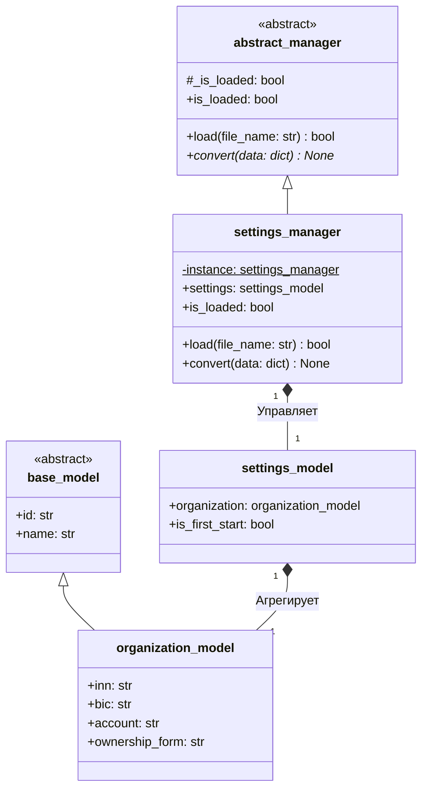
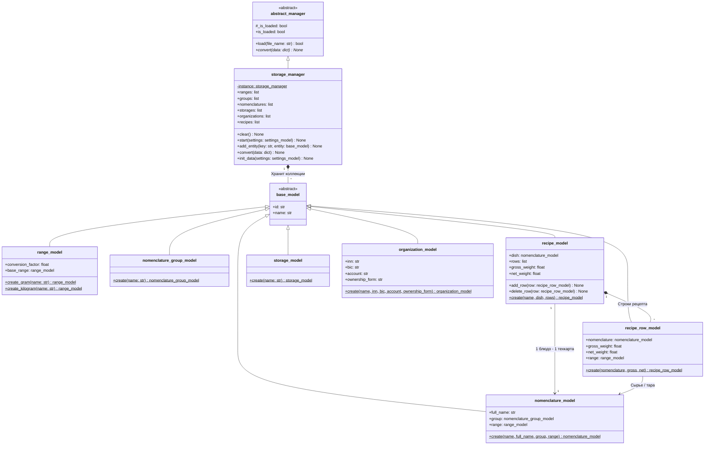
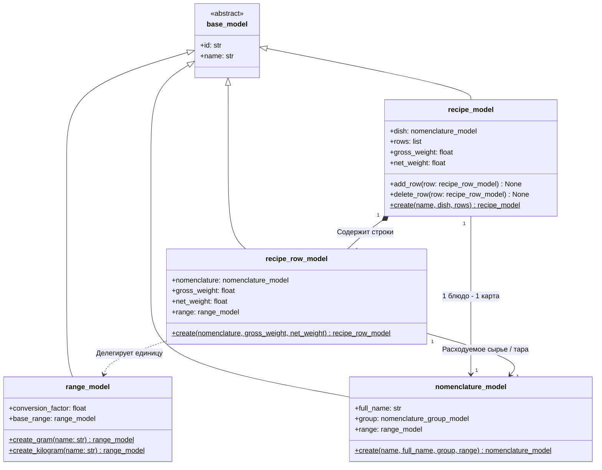
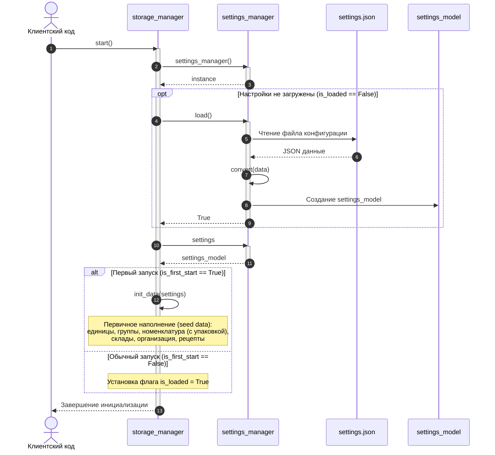

# UML-диаграммы подсистем управления данными

Данный документ содержит UML-диаграммы классов и диаграмму последовательности для компонентов `settings_manager` и `storage_manager` информационной системы сети ресторанов «Ромашка».

---

## 1. Диаграмма классов `settings_manager`

Менеджер настроек реализует паттерн **Singleton** и отвечает за загрузку конфигурационного файла `settings.json`, валидацию пути и структуры, а также трансформацию словаря настроек в композитную модель `settings_model`.

---

## 2. Диаграмма классов `storage_manager`

`storage_manager` реализует паттерн **Singleton** и хранит коллекции доменных сущностей с контролем уникальности записей по наименованию (`name`) и идентификатору (`unique_code`). При первом запуске системы (`is_first_start == True`) менеджер производит автоматическое первичное наполнение (seed data).

---

## 3. Диаграмма классов моделей технологических карт (рецептов)

Диаграмма детально отражает доменные модели производственного учета: технологическую карту (`recipe_model`) и строку расхода (`recipe_row_model`), а также их связи с номенклатурой (`nomenclature_model`) и единицами измерения (`range_model`).

---

## 4. Диаграмма последовательности: Инициализация и запуск хранилища

Диаграмма иллюстрирует базовый сценарий взаимодействия компонентов при запуске хранилища (`storage_manager.start()`): получение настроек через `settings_manager`, загрузку файла `settings.json` (если настройки еще не были загружены) и первичное наполнение данными (`init_data()`) при первом старте системы (`is_first_start == True`).

