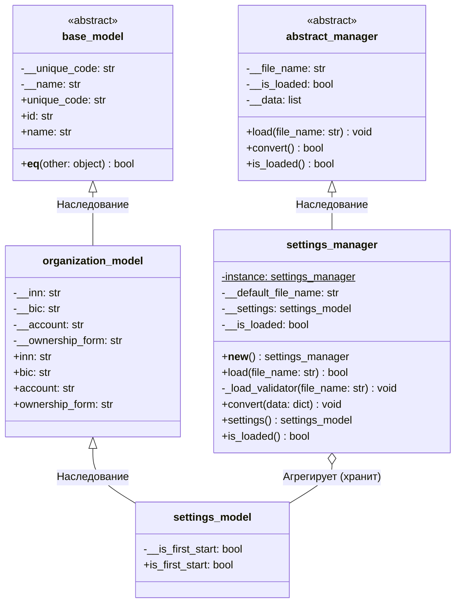
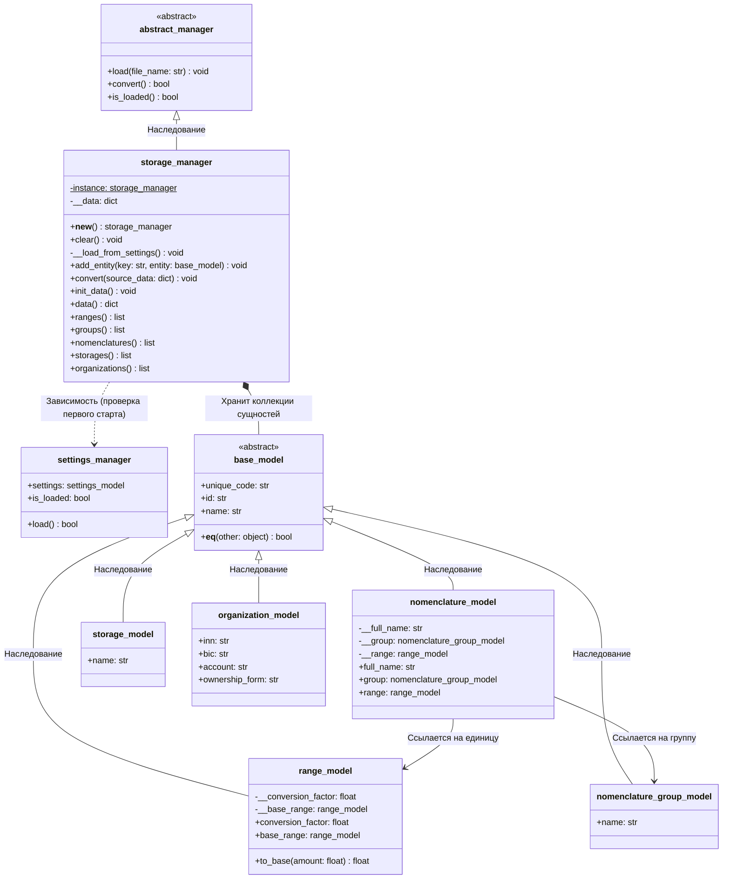
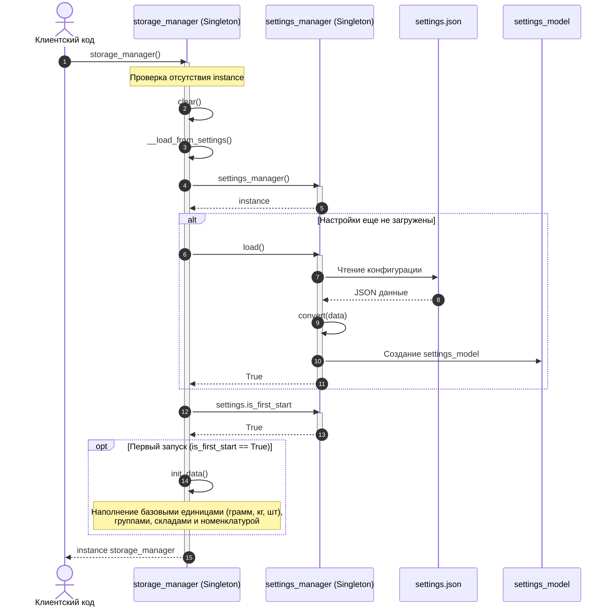

# UML Диаграммы классов подсистем управления данными

Данный документ содержит UML-диаграммы классов и взаимодействия для компонентов `settings_manager` и `storage_manager` информационной системы сети ресторанов «Ромашка».

---

## 1. Диаграмма классов `settings_manager`

Менеджер настроек реализует паттерн **Singleton** и отвечает за загрузку конфигурационного файла `settings.json`, валидацию пути и структуры, а также трансформацию словаря настроек в модель `settings_model`.

---

## 2. Диаграмма классов `storage_manager`

`storage_manager` реализует паттерн **Singleton** и хранит списки доменных сущностей с контролем уникальности записей по идентификатору (`unique_code`). При первом запуске системы (`is_first_start == True`) менеджер производит автоматическое первичное наполнение (seed data).

---

## 3. Диаграмма последовательности: Инициализация при первом старте

Диаграмма демонстрирует сценарий взаимодействия компонентов при первичном запуске системы:

